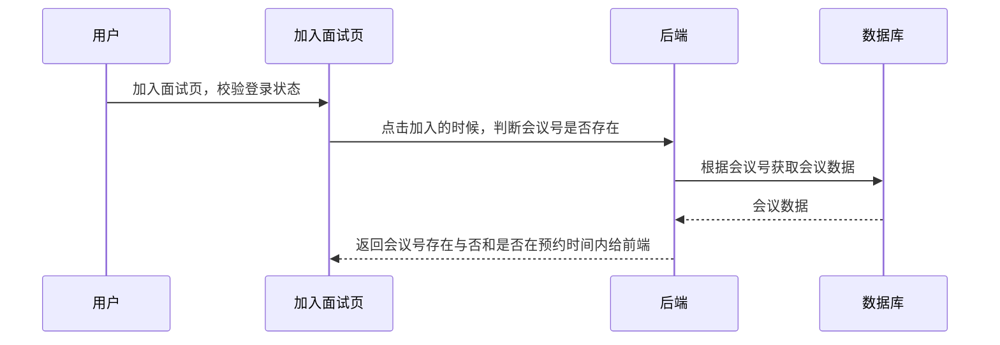
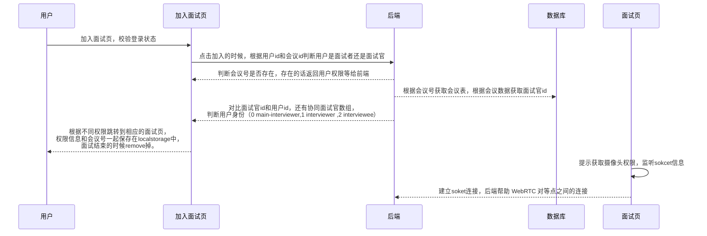
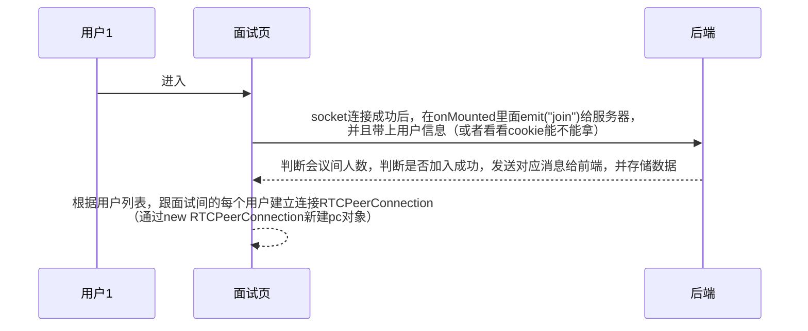
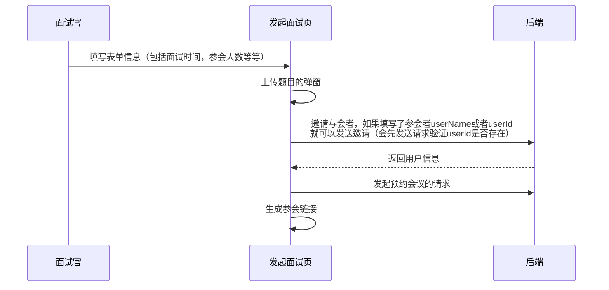
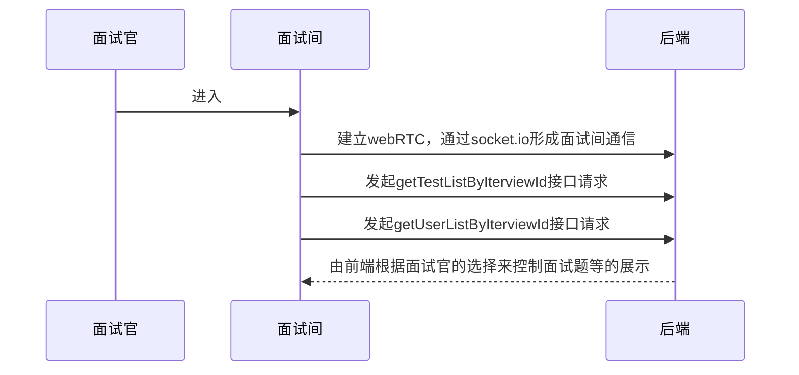
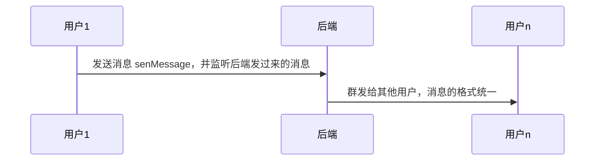

## 核心会议连接模块

### 原理


这里是由ClientA发起B来接受A的视频数据。

上图总结可以为A创建本地视频流，把视频流添加到PeerConnection里面，创建一个Offer给B，B收到Offer以后，保存这个offer，并响应这个Offer给A，A收到B的响应后保存A的远端响应，进行NAT穿透，完成链接建立。

1. api
   - **`RTCPeerConnection`** 接口代表一个由本地计算机到远端的 WebRTC 连接。该接口提供了创建，保持，监控，关闭连接的方法的实现。

### 实现

```markdown
## 信令服务器(P2P/Mesh)

### 用途
- 通过这个第三方服务器，这两台设备可以相互定位，并交换协商消息。作为一个中间人帮助双方在尽可能少的暴露隐私的情况下建立连接

### 特征

- 它仅在对等点之间中继提供和回答的会话信息信号。因此，服务器上的负载仅在 WebRTC 第一次在对等点之间中继信息时发生。
- 点之间的连接完成后，服务器上没有额外的负载。
- 适用于 1:1 连接。

### 优点

- 因为服务器负载低，所以服务器资源少。
- 实时性是有保证的，因为数据是通过对等点之间的直接连接来发送和接收的。

### 缺点

- 在 1:N 或 N:M 连接中，客户端的过载会迅速增加。例如，假设有5个人连接到WebRTC，如上图所示，有4个Uplink（将我的数据发送给其他连接用户的数量）和4个Downlink（连接其他用户的数据到我这里的数量）。它维护8条链路并发送和接收数据。（图中，数据交换表示为链接。）
```

采用socket.io和webRTC，基于信令服务器(P2P)

1. 通过socket.io实现连接
2. 监听connecttion连接事件
3. 判断房间是否满员（否则继续，是则退出）
4. 建立socket.id和房间的映射

1. 信令服务器端：

   socket监听，变量users = {  [房间号]：参会者数组  };  socketToRoom = {【socket.id】：房间号 };

   - **join_room**事件
     - 判断房间是否存在，不存在的话就创建，存在的话判断是否满员
   - **offer**事件
     - 将到手的请求（**offer**）（遵循sdp协议）emit出去
   - **answer**事件
     - 将到手的answer（遵循sdp协议）emit出去
   - **candidate**事件
     - 两个节点需要交换 ICE 候选来协商他们自己具体如何连接，每一个 ICE 候选描述一个发送者使用的通信方法，每个节点按照他们被发现的顺序发送候选并且保持发送直到退出，即使媒体数据流已经开始传递也要如此。
     - 将到手的candidate emit出去
   - **disconnect**事件
     - 

2. 用户端

   ```tsx
   // 新建RTC连接
   let newPC = new RTCPeerConnection(pc_config);
   ```

3. 


### 思考

1. 为什么不能在webwoker里面使用webRTC

   ```
   1. 根据规范[1，2]，navigator.mediaDevices 和RTCPeerConnection 没有为 web workers 定义，所以 WebRTC 暂时不应该在 web workers 上使用。
   2. 对于[1]，navigator.mediaDevices 属性被定义在窗口的Navigator 接口上，但没有定义在 web worker 的WorkerNavigator 接口上。
   3. 对于[2]，RTCPeerConnection 接口被暴露给窗口（[Exposed=Window] ），但没有暴露给 web worker（[Exposed=Worker] ）。
   ```

   

## 主要模块设计

### 加入面试间




### 面试间

进入面试间内时还是要再判断一次权限，防止用户篡改权限



进入面试间后



面试者页面：

- 无题目

- 有编程题

- 有文本题

  无题目的页面到有题目的页面的转变

socket事件：

- join_room
  - room：房间号/会议号
  - name：用户参会名称
  - userID：用户真实名称/或者用户id，标识用户信息
- offer
  - offerReceiveID：接收offer的用户的socket id
  - sdp：RTCSession 用户发送offer的描述
  - offerSendID：发送offer的用户socket id
  - offerSendUserID：发送方身份标识
- answer
  - answerSendID：用户发送应答的socket id
  - sdp: RTCSession 用户发送应答的描述
  - answerReceiveID：接收应答的用户的套接字 ID
- candidate
  - candidateSendID：用户发送RTCIceCandidate的socket id
  - candidate: 发送者的RTCIceCandidate
  - candidateReceiveID：接收候选人的用户套接字ID


通过链接进入面试间：

### 预约面试模块

**会议预约表单信息：**

- 自动生成的会议号，
- 会议标题，（input）
- 预约时间，（时间选择器）
- 持续时间，（数字填写）
- 参会人数，（数字填写）
- 面试类型选择，（多选框 - 是否需要编程题板1，是否需要txt题板2）
- 面试权限选择：（多选框），
- 邀请与会者（一个加号，点击加号弹出弹窗，弹窗输入userID，选择user权限） ( 搜索输入框，完成输入后向后端进行请求查看用户是否存在，不存在就提示错误，存在完成输入)



### 面试间模块

面试间上限20个人

1. 面试官：
   - 面试官的面试间应该有：所有面试题的按钮（点击选择/取消）
   - 所有与会人员列表，hover/点击上去能看见具体的用户信息，面试官可以编辑其他人的权限（把其他人也变成协同面试官，协同面试官可以出题）
   - 如果题目开启了就显示题目tab栏和编程框（编程框是协同合作的，面试者和面试官协同，面试题目区域有选择当前查看哪一个面试者的题目的选项）
   - 还有聊天框，聊天框内容不做记录，没有私聊功能，聊天框全部与会者都可见




### 聊天部分



消息格式：

- messageId
-  name: interviewStore.userInterviewName,
-  userID: userStore.userID || userStore.username,
-  message：消息


### 权限设计

#### 角色权限设计

角色不固定，基于userId和interviewId决定

1. 面试官：有出题，编辑与会者权限，选择已经出好的题，查看用户信息，结束会议等功能 0
2. 协同面试官：有出题，选择已经出好的题，查看用户信息等功能 1
3. 面试者：只有看题做题的权限 2

#### 路由权限设计


## 数据库设计

interviewee面试者

interviewer面试官

### 表设计

1. Interview 面试信息列表：

   - id

   - video_id(可以为空，为空就证明没有进行录制)

   - interview_number 会议号，6位随机数字，unique

   - title 会议标题

   - Start_time 预约时间

   - End_time 结束时间 

   - participan_count 与会人数

   - auth  面试回放查看权限（1.面试视频不保存，2.保存且私有，3保存且对面试者公开，4保存且对所有人公开）

   - testAuth 题目查看权限（1.题目权限开放给面试者复盘 2.题目不开放给面试者复盘 ）

   - type：面试状态（0.面试未开始，1.面试正常结束，2.面试过期）

   ```
   通过关系去获取并处理后要一起返回给前端的数据：
   - participant_ids (与会者id数组，可为空数组，等有人参加了再添加)（包含interviewer_ids 数组）
   - interviewer_ids (协同面试官id数组，可为空数组，等有人参加了再添加)
   - test_ids (题目id数组，可为空数组)
   - show_test_ids(展示给面试者的题目数组)
   ```

2. Test 我上传的题目表：

   - id

   - user_id（上传者id，外键）

   - test_number （题号）

   - type （1.编程题，2.txt题 ）

   - title 

   - content 

   - answer 

   - auth. (1. 公开 2.私有)

3. TestInterview 面试题目-面试 关系表

   - id
   - test_id  题目id，外键
   - interview_id 面试id，外键
   - isSelected 是否展示给用户 

4. UserIntervie 面试者-面试 关系表

   - id

   - user_id 与会者id，外键

   - interview_id 面试id，外键

   - type （1-面试官，2-协同面试官，3-面试者）

   - mark （备注，面试者可以在个人中心对该面试进行备注，面试官也可以在发布面试或者个人中心添加备注）

   - pass (面试是否通过)

5. UserTest 面试者-题目 关系表

   - id

   - user_id 与会者id，外键

   - test_id 面试id，外键

   - answer 用户填写的答案

   - testAuth （1.题目权限开放给面试者复盘 2.题目不开放给面试者复盘 ）


### 接口设计

1. 面试官预约面试：
   - 根据userID/username 查看用户是否存在
   - addInterview: 预约会议 
   - 

2. 面试官进入面试间：

   - getTestListByInterviewId根据面试间id获取题目列表 getTestListByInterviewId
     - 根据InterviewId查询Iterview表获取Interview，根据test_ids查询Test表

   - 根据面试间id获取参会者列表 getUserListByIterviewId
     - 根据InterviewId查询Iterview表获取Interview，根据participant_ids查询user表

   - 根据面试间id获取参会者列表 getistByIterviewId
     - 根据InterviewId查询Iterview表获取Interview，根据test_ids查询Test表

3. 面试官查看自己发起过的会议
4. 面试者查看自己参加过的会议

## 问题

1. 如果出现网络错误，会议突然崩溃怎么办？
   - 用户一旦退出，sokcet就会断开连接，重新进入重新连接
   - 用户答题的状态和内容的保存将会保存在本地localstorege里面（通过pinia）/或者保存入数据库，然后用户重新进入的时候取用，（需要跟房间号关联），当面试结束，

