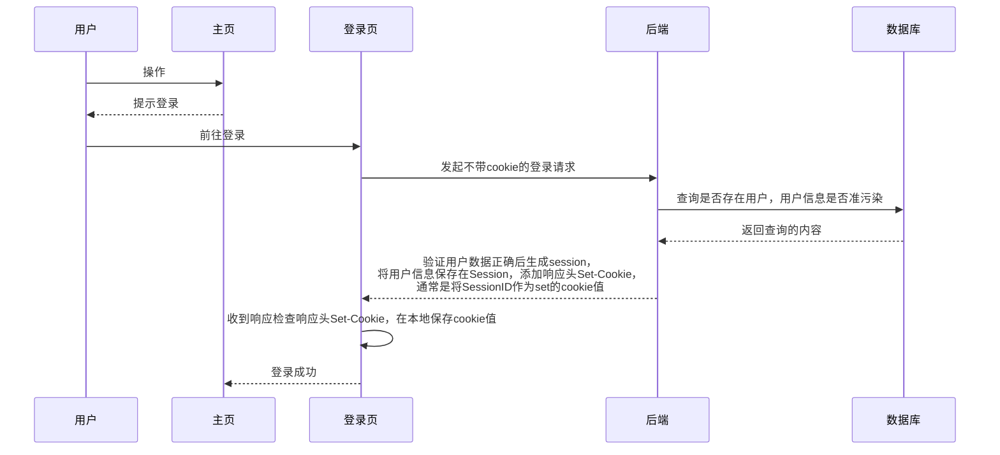
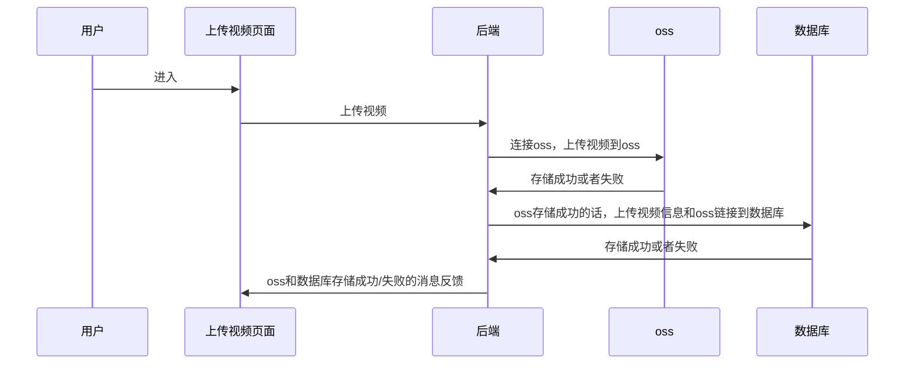
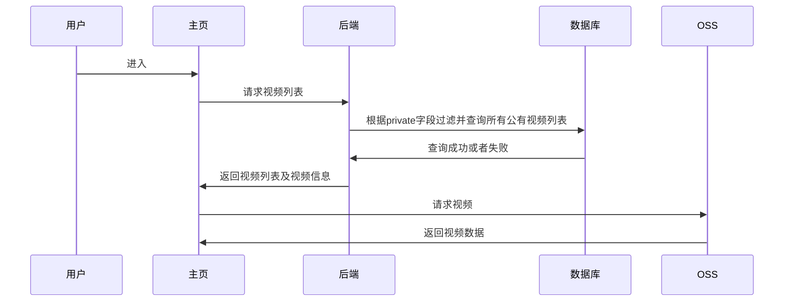

## 登录注册

```mermaid
sequenceDiagram
用户 ->> 主页: 操作
主页 -->> 用户: 提示登录
用户 ->> 登录页: 前往登录
登录页->> 后端: 发起不带cookie的登录请求
后端 ->> 数据库: 查询是否存在用户，用户信息是否准污染
数据库-->>后端: 返回查询的内容
后端-->>登录页: 验证用户数据正确后生成session，<br>将用户信息保存在Session，添加响应头Set-Cookie，<br>通常是将SessionID作为set的cookie值
登录页->>登录页: 收到响应检查响应头Set-Cookie，在本地保存cookie值
登录页 -->> 主页: 登录成功
```

1. 之后每次发起请求时，自动在请求头Cookie中携带口令，发送给服务端

2. 服务端获取Cookie携带的口令值，找到对应的Session，就可以判断用户状态

   ps：session在服务器端程序运行的过程中创建的，存储在运行时内存中

### 视频上传模块

```mermaid
sequenceDiagram
用户 ->> 上传视频页面: 进入
上传视频页面->> 后端: 上传视频
后端 ->>oss: 连接oss，上传视频到oss
oss ->> 后端: 存储成功或者失败
后端 ->> 数据库: oss存储成功的话，上传视频信息和oss链接到数据库
数据库->> 后端: 存储成功或者失败
后端 ->> 上传视频页面: oss和数据库存储成功/失败的消息反馈
```

文件切片，webwoker，oss上传

### 视频请求模块

```mermaid
sequenceDiagram
用户 ->> 主页: 进入
主页 ->> 后端: 请求视频列表 
后端 ->> 数据库: 根据private字段过滤并查询所有公有视频列表
数据库->> 后端: 查询成功或者失败
后端 ->> 主页: 返回视频列表及视频信息
主页 ->> OSS: 请求视频
OSS ->> 主页: 返回视频数据
```

