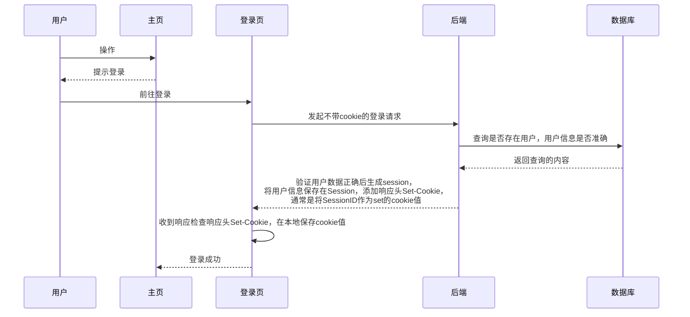
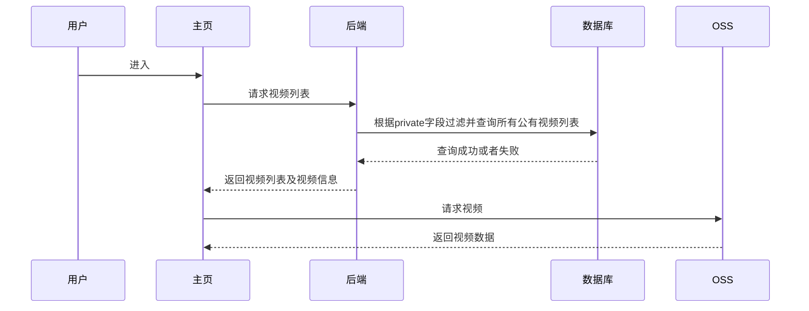

## 前端技术点

1. 大文件切片上传
2. webWoker
3. WebRTC
4. Cookie验证登录

## 主要模块设计

### 登录注册模块

注册

~~~mermaid
sequenceDiagram
用户 ->> 注册页: 用户前往注册，输入信息
注册页->>注册页: 校验输入的信息
注册页->> 后端: 发起getPublicKey请求获取公钥
后端 -->> 注册页: 使用crypto.generateKeyPairSync方法,根据rsa加密算法生成公钥并返回
注册页 ->> 后端: 使用公钥对密码进行加密，将注册信息发送给后端
后端 ->> 数据库: 校验用户是否存在
后端 -->>后端: 用户存在则提示重新注册，用户不存在则使用私钥对密码进行解密
后端 ->> 数据库: 使用md5对真正的密码进行加密并将用户名密码存储到数据库
后端 -->> 注册页: 注册成功

~~~

登录

1. 之后每次发起请求时，自动在请求头Cookie中携带口令，发送给服务端

2. 服务端获取Cookie携带的口令值，找到对应的Session，就可以判断用户状态

   ps：session在服务器端程序运行的过程中创建的，存储在运行时内存中

3. 登录校验

### 视频上传模块

文件切片，webwoker，oss上传

### 视频请求模块

## 数据库设计